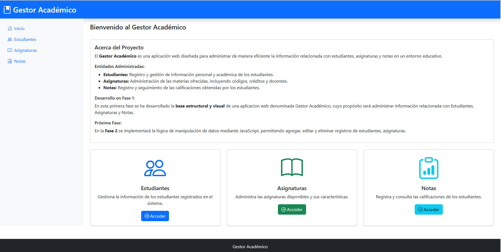
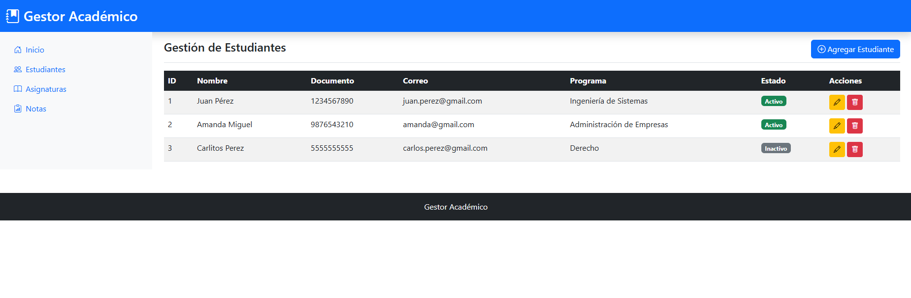
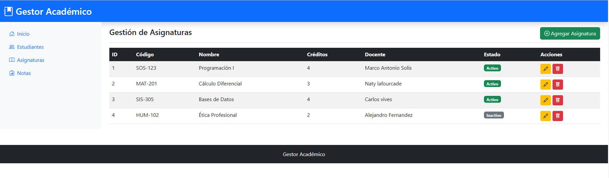
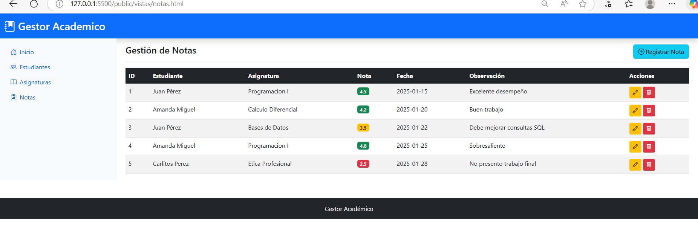

# Gestor Académico

## Descripción

El **Gestor Académico** es una aplicación web diseñada para administrar de manera eficiente la información relacionada con estudiantes, asignaturas y notas en un entorno educativo. Este proyecto facilita la organización y gestión de datos académicos mediante una interfaz intuitiva y funcional.

### Entidades Administradas

- **Estudiantes**: Registro y gestión de información personal y académica de los estudiantes
- **Asignaturas**: Administración de las materias ofrecidas, incluyendo códigos, créditos y docentes
- **Notas**: Registro y seguimiento de las calificaciones obtenidas por los estudiantes

## Fase Actual: Fase 1

En esta primera fase se ha desarrollado la **base estructural y visual** del sistema.

- ✅ Arquitectura del proyecto organizada en GitHub
- ✅ Diseño de vistas HTML con estructura consistente
- ✅ Navegación clara entre módulos mediante sidebar
- ✅ Estilos coherentes utilizando Bootstrap 5
- ✅ Tablas estructuradas para cada entidad
- ✅ Modales preparados para futura funcionalidad
- ✅ Diseño responsive para diferentes dispositivos

## Próxima Fase: Fase 2

En la siguiente fase se implementará:

- 🔄 Lógica de manipulación de datos con JavaScript
- 🔄 Funcionalidad para agregar registros
- 🔄 Funcionalidad para editar registros
- 🔄 Funcionalidad para eliminar registros
- 🔄 Validación de formularios
- 🔄 Almacenamiento de datos (localStorage o similar)

## Estructura del Proyecto
```
gestor-academico/
│
├── public/
│   ├── index.html                 # Página principal
│   ├── vistas/
│   │   ├── estudiantes.html       # Gestión de estudiantes
│   │   ├── asignaturas.html       # Gestión de asignaturas
│   │   └── notas.html             # Gestión de notas
│   └── assets/
│       └── img/
│           └── capturas/          # Capturas de pantalla
│               ├── index.png
│               ├── estudiantes.png
│               ├── asignaturas.png
│               └── notas.png
│
├── src/
│   └── css/
│       └── style.css              # Estilos personalizados
│
└── README.md                      # Documentación del proyecto
```


## Instrucciones de Ejecución

### Opción 1: Abrir directamente en el navegador

1. Descarga o clona el repositorio:
```bash
   git clone https://github.com/Valentina-Gallego-Ramos/Gestor-academico.git
```

2. Navega a la carpeta del proyecto:
```bash
   cd Gestor-academico
```

3. Abre el archivo `public/index.html` en tu navegador web preferido:
   - Doble clic en el archivo
   - O clic derecho → Abrir con → Navegador


#### Con la extensión Live Server de VS Code:
1. Instala la extensión "Live Server" en VS Code
2. Abre el archivo `public/index.html`
3. Clic derecho → "Open with Live Server"

## Navegación del Sistema

El sistema cuenta con cuatro secciones principales accesibles desde el sidebar:

1. **Inicio**: Página de bienvenida con descripción del proyecto y acceso rápido a los módulos
2. **Estudiantes**: Módulo de gestión de estudiantes con tabla y formulario
3. **Asignaturas**: Módulo de gestión de asignaturas con tabla y formulario
4. **Notas**: Módulo de gestión de notas con tabla y formulario

## Capturas de Pantalla

### Página Principal


### Gestión de Estudiantes


### Gestión de Asignaturas


### Gestión de Notas


## Características Principales

### Diseño Consistente
- Header con título del sistema en todas las páginas
- Sidebar con navegación e iconografía clara
- Footer informativo
- Paleta de colores coherente

### Tablas Estructuradas
- Columnas organizadas para cada entidad
- Botones de acción (Editar/Eliminar) en cada fila
- Diseño responsive que se adapta a pantallas pequeñas

### Modales Funcionales
- Formularios preparados para agregar/editar registros
- Campos de entrada apropiados para cada tipo de dato
- Botones de acción claramente identificados

### Responsive Design
- Adaptación automática a diferentes tamaños de pantalla
- Sidebar colapsable en dispositivos móviles
- Tablas con scroll horizontal en pantallas pequeñas


